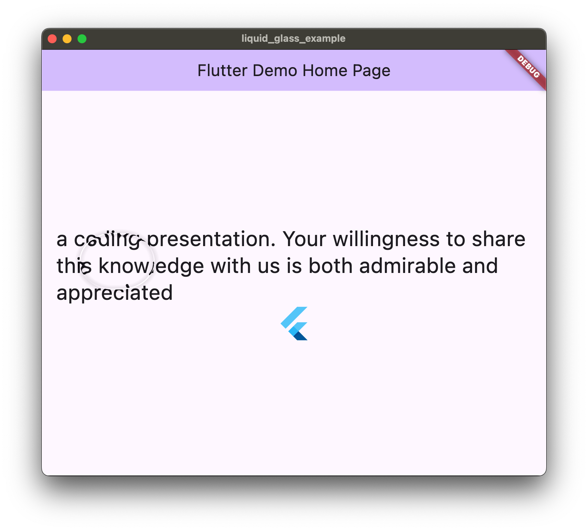

# liquid_glass_example

Example of liquid glass effect in Flutter

This LiquidGlass effect can be achieved by reflecting the internal texture at the edge of the glass. But maybe this example is not good enough. Such as the blurred(or frosted) content is not implemented, as it's optional in apples design.

Probably can be used in other packages.

## Effect comparison

| The apple's effect                                                                                             | The example                                       |
|----------------------------------------------------------------------------------------------------------------|---------------------------------------------------|
|  |  |

Video

https://github.com/user-attachments/assets/1450ee1d-06c8-4b4f-9853-6c9a5d280ed8

## TODOs

- Implement blurred content.
- Implement shadow.
- Configurable parameters(size, radius, lightDirection, et).
